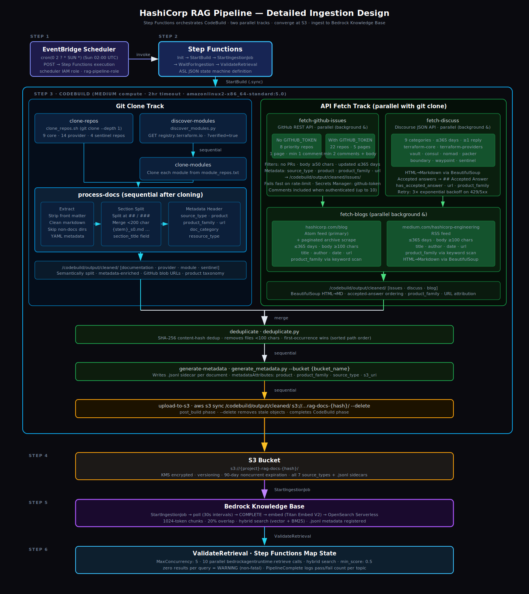

# HashiCorp Bedrock RAG Pipeline

A production-grade Terraform repository that provisions and operates a Retrieval-Augmented Generation (RAG) system on Amazon Web Services. The system ingests HashiCorp's public documentation from GitHub repositories and the Terraform Registry API into an Amazon Bedrock Knowledge Base, and keeps it current via automated weekly refresh.

Clone it, set a few variables, and run `task up` — a single command provisions all infrastructure and ingests the documentation.

---

## Architecture

<p align="center">
  
</p>

EventBridge Scheduler triggers Step Functions weekly. Step Functions orchestrates CodeBuild (data ingestion), Bedrock Knowledge Base (sync), and a 10-query parallel retrieval validation that covers all product families and source types. All infrastructure is provisioned by Terraform. CodeBuild clones this repository directly via its public HTTPS URL — no GitHub connection, OAuth app, or personal access token required for public repositories.

### Ingestion Pipeline

<p align="center">
  
</p>

The pipeline runs two parallel tracks inside CodeBuild: a **git clone track** that shallow-clones HashiCorp repos and processes markdown through semantic section splitting and metadata enrichment, and an **API fetch track** that queries the GitHub Issues API, Discourse API, and blog feeds in parallel. Both tracks converge at a single `aws s3 sync` upload step, after which Step Functions calls the Bedrock `StartIngestionJob` API to chunk, embed, and index all documents.

---

## Data Sources

The pipeline ingests content from seven source types across three collection methods:

### Git-cloned sources

| Source | `source_type` | Repos | What's ingested |
|---|---|---|---|
| **HashiCorp core products** | `documentation` | 9 repos — Terraform, Vault, Consul, Nomad, Packer, Boundary, Waypoint | Official product docs from `website/docs/` |
| **Terraform providers** | `provider` | 14 repos — AWS, Azure, GCP, Kubernetes, Helm, Docker, Vault, Consul, Nomad, and more | Resource and data source reference docs |
| **Terraform Registry modules** | `module` | Dynamically discovered via the Registry API | Docs from HashiCorp-verified modules |
| **Sentinel policy libraries** | `sentinel` | 4 repos | Policy definitions and usage documentation |

### API-fetched sources

| Source | `source_type` | What's ingested |
|---|---|---|
| **GitHub Issues** | `issue` | Issues from the last 365 days from 8 priority repos. Filtered: PRs excluded, minimum body length, minimum comment count, label denylist. Resolution quality scored (high/medium/low). |
| **HashiCorp Discuss** | `discuss` | Forum threads with at least 1 reply from the last 365 days across 9 categories. Accepted answers reordered to front. |
| **HashiCorp Blog** | `blog` | Posts from the last 365 days from hashicorp.com/blog and medium.com/hashicorp-engineering. Full content extracted via BeautifulSoup. |

### Metadata

Every document begins with a compact attribution prefix (~15 tokens vs ~100 tokens for YAML front matter):

```
[provider:aws] aws_instance — Argument Reference

[discuss:terraform] How do I manage multiple workspaces?

[issue:vault] #1234 (closed): Dynamic secrets not rotating
```

---

## Prerequisites

- **AWS account** with billing enabled
- **AWS CLI** installed and credentials configured — environment variables (`AWS_ACCESS_KEY_ID` / `AWS_SECRET_ACCESS_KEY`), `aws configure`, or AWS SSO
- **Terraform** >= 1.5, < 2.0
- **Python** 3.11+
- **Task** ([taskfile.dev](https://taskfile.dev)) — `brew install go-task`
- **Python packages** — `pip install boto3 pyyaml requests pytest beautifulsoup4`
- **shellcheck** — `brew install shellcheck`
- **jq** — `brew install jq`
- **Bedrock model access** — enable `amazon.titan-embed-text-v2:0` in Bedrock console → Model access

---

## Quick Start

1. **Clone the repository**

   ```bash
   git clone <this-repo-url>
   cd hashicorp-bedrock-ai-rag
   ```

2. **Configure AWS credentials**

   Choose any one method — the preflight check detects all of them:

   ```bash
   # Environment variables (preferred for CI and short-lived sessions)
   export AWS_ACCESS_KEY_ID=AKIA...
   export AWS_SECRET_ACCESS_KEY=...
   export AWS_SESSION_TOKEN=...        # required when using temporary credentials

   # Named profile (IAM long-term keys)
   aws configure

   # AWS SSO
   aws sso login --profile my-profile
   ```

   Verify with `task login`.

3. **Create a virtual environment and install Python dependencies**

   ```bash
   python3 -m venv .venv
   .venv/bin/pip install boto3 pyyaml requests pytest beautifulsoup4 mcp
   ```

4. **Enable Bedrock model access**

   In the AWS Console: Bedrock → Model access → Request access for **Titan Text Embeddings V2** (`amazon.titan-embed-text-v2:0`).

5. **Run preflight checks** (optional — `task up` runs these automatically)

   ```bash
   task preflight
   ```

6. **Deploy everything with one command**

   ```bash
   task up REPO_URI=https://github.com/my-org/hashicorp-bedrock-ai-rag
   ```

   Optional overrides:

   ```bash
   task up REPO_URI=https://github.com/my-org/hashicorp-bedrock-ai-rag REGION=eu-west-2
   ```

   `task up` runs five steps automatically:

   | Step | What happens |
   |---|---|
   | 0 | Preflight checks — tools, auth, Python packages, repo files, Terraform validation |
   | 1 | S3 state bucket + DynamoDB lock table created (idempotent) |
   | 2 | All AWS infrastructure provisioned — IAM roles, S3, OpenSearch Serverless, CodeBuild, Step Functions, EventBridge |
   | 3 | `create_knowledge_base.py` creates the Bedrock Knowledge Base and S3 data source; writes `kb.auto.tfvars` |
   | 4 | Second `terraform apply` wires KB/DS IDs into the EventBridge Scheduler target |
   | 5 | First pipeline run triggered — CodeBuild ingests docs, Bedrock indexes them |

7. **Validate retrieval quality**

   ```bash
   task pipeline:test KB_ID=<KNOWLEDGE_BASE_ID>
   ```

---

## Configuration

| Variable | Default | Description |
|---|---|---|
| `region` | `us-west-2` | AWS region for all resources |
| `repo_uri` | (required) | GitHub HTTPS URL of this repo |
| `refresh_schedule` | `cron(0 2 ? * SUN *)` | EventBridge cron expression (UTC) |
| `knowledge_base_name` | `hashicorp-knowledge-base` | Bedrock Knowledge Base display name |
| `collection_name` | `hashicorp-rag-vectors` | OpenSearch Serverless collection name |
| `chunk_size` | `1024` | Max tokens per chunk |
| `chunk_overlap_pct` | `20` | Chunk overlap percentage |
| `notification_email` | `""` | Email for CloudWatch alarms (empty = disabled) |

---

## Using the RAG Knowledge Base with AI Coding Assistants

### Claude Code via MCP Server

The MCP server in `mcp/server.py` exposes the Knowledge Base as tools that Claude Code calls automatically when answering questions about HashiCorp products.

```bash
task mcp:install                   # install mcp + boto3 into .venv
task mcp:setup KB_ID=ABCDEFGHIJ   # register with Claude Code, then restart
task mcp:test  KB_ID=ABCDEFGHIJ   # smoke-test retrieval
```

Available tools:
- **`search_hashicorp_docs`** — hybrid search with optional `product_family` and `source_type` filters
- **`get_knowledge_base_info`** — inspect region/KB/status

### Claude Code via Amazon Bedrock

Route Claude Code through your AWS account's Bedrock endpoint:

```bash
task claude:setup                              # default (us-west-2, claude-sonnet-4-20250514)
task claude:setup CLAUDE_REGION=eu-west-2
task claude:setup PERSIST=true                 # persist to ~/.bashrc
```

### Programmatic access (retrieve-then-prompt)

```python
import boto3
import anthropic

# 1. Retrieve context
runtime = boto3.client("bedrock-agent-runtime", region_name="us-west-2")
response = runtime.retrieve(
    knowledgeBaseId="ABCDEFGHIJ",
    retrievalQuery={"text": "How do I use Vault dynamic secrets with Terraform?"},
    retrievalConfiguration={
        "vectorSearchConfiguration": {"numberOfResults": 5, "overrideSearchType": "HYBRID"}
    }
)
context = "\n\n---\n\n".join(
    r["content"]["text"] for r in response["retrievalResults"]
)

# 2. Pass to Claude
client = anthropic.Anthropic()
message = client.messages.create(
    model="claude-sonnet-4-20250514",
    max_tokens=2048,
    messages=[{"role": "user", "content": f"Context:\n{context}\n\nHow do I use Vault dynamic secrets with Terraform?"}],
)
```

---

## Token Efficiency

The Knowledge Base provides significant token savings versus pasting raw documentation:

| Query | RAG tokens | Raw tokens | Saving |
|---|---|---|---|
| S3 backend configuration | ~300 | 9,500 | 97% |
| AWS provider setup | ~380 | 11,000 | 97% |
| Vault dynamic secrets | ~850 | 14,000 | 94% |
| Cross-product: Vault + AWS provider | ~670 | 22,000 | 97% |
| Nomad job scheduling | ~1,330 | 12,000 | 89% |
| **Average** | **~580** | **~13,600** | **96%** |

Run the benchmark yourself:

```bash
task pipeline:token-efficiency KB_ID=ABCDEFGHIJ
```

---

## Costs

| Component | Notes |
|---|---|
| OpenSearch Serverless | Minimum 2 OCUs = ~$350/month even at zero queries |
| Amazon Bedrock | Pay-per-call for embedding (ingestion) and retrieval |
| S3 | Storage for processed markdown (~GB range) |
| CodeBuild | Per-build-minute; `BUILD_GENERAL1_MEDIUM` |
| Step Functions | Per-state-transition; negligible for weekly runs |
| EventBridge Scheduler | Negligible |

**OpenSearch Serverless is the dominant cost driver.** Use Aurora PostgreSQL Serverless v2 (`type = "RDS"`) if cost is a concern — it can scale to 0 ACUs during idle periods.

---

## How to monitor and troubleshoot

See [docs/RUNBOOK.md](docs/RUNBOOK.md) for the full operational runbook.

Quick links (replace `REGION` and `ACCOUNT_ID`):
- Step Functions: `https://console.aws.amazon.com/states/home?region=REGION`
- CodeBuild: `https://console.aws.amazon.com/codesuite/codebuild/projects?region=REGION`
- Bedrock KB: `https://console.aws.amazon.com/bedrock/home?region=REGION#/knowledge-bases`

---

## Licence

Apache 2.0 — see [LICENSE](LICENSE).
